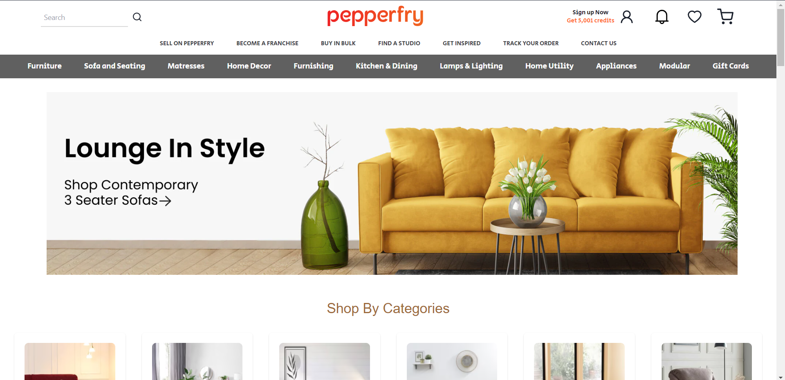
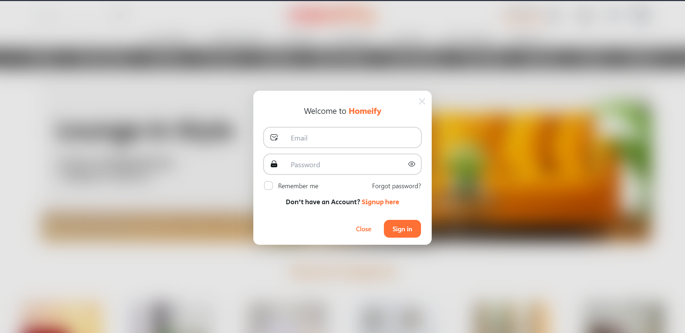

<div align="center">


[See Live Coming Soon!]

### _Shopping_, Website

<div align="center">
      
      
      
      <br>
 </div>

---

</div>

<h1 align="center">About Homeify</h1>

## Summary

It is a Fully Responsive Shopping Website a Similar Product of Pepperfry.com. It is backend integrated and fully authenticated using React Js.
We have Used the best version and UI components from several fields along with the power of React JS to make it fully user friendly._Accessed By anyone from Anywhere_.

## Features

#### Frontend

It's Frontend is fully made up of raw HTML,CSS and JS.

#### Backend

The Means which we used to store data is JSON through JSON-server API calls.

# Docs

- Table of Contents

  - [Codebase](#codebase)

    - [Technologies](#technologies)
    - [Folder Structure](#folder-structure)

  - [Project Setup](#project-setup)

    - [First time setup](#first-time-setup)
    - [Installation](#installation)
    - [Running the app locally](#running-the-app-locally)

  - [Testing](#testing)
  - [How to use B-donate](#how-to-use-B-donate)

## Codebase

### Technologies

With the ground rules out of the way, let's talk about the coarse architecture of this mono repo:

Here is a list of all the big technologies we use:

<div align="center">
      
      
      
      
</div>
<div align="center">
      
</div>

### Folder structure

```sh

B-Donate/

├── homeify # Files used on the frontend
      ├── public
            ├── assets          #Contains all Images and Videos used
              ├── Images
              ├── Videos
    ├── src #Contains all React FronEnd Files
        ├── components  #All Related Components
              ├── Main           #Main UI Rendered Pages
              ├── Personal       #Eaxh Personal developer related components
        
    

├── server #Backend api and Mogo Schemas
      ├── Schema #All Colletions Models


```

## Project Setup

### First time setup

The first step to running Homeify locally is downloading the code by cloning the repository:

```sh

git clone https://github.com/addymistrel/Homeify.git

```

### Installation

Homeify has a single installation step:

- **Install the dependencies**:

```sh

npm install

```

You've now finished installing everything! Let's start :100:

Ps: if you're getting error installing the dependencies, try --force command along with npm install. For example

```sh

npm install --force

```

Now you're ready to run the app locally and sign into your local instance!

### Running the app locally

#### Start the servers and Land on the Page

To Start the json-server for Backend run

```sh
npm run server
```

Then

```
Run index.html in "root" folder on live server through vs code
```

Facing Difficulty on running with live server [VISIT](https://youtu.be/y4qqQeUDCBQ)

<div  align="center"></div>

## B-Donate Workflow


## Screenshots



## Feedback

If you have any feedback or suggestions please reach out to the Project-Maintainer [Aditya Kumar](https://github.com/addymistrel)

## 👩🏽‍💻 Contributing

- Contributions make the open source community such an amazing place to learn, inspire, and create.
- Any contributions you make are greatly appreciated.

<br>

<div align="center">

## Thanks to all Collaborators 💪

Thanks a lot for spending your time helping B-Donate grow. Thanks a lot! Keep rocking 🍻

[](https://github.com/addymistrel/Homeify/graphs/contributors)

<div align="left">
For further queries and whereabouts you can communicate and reach out to the owner through <a href="https://www.linkedin.com/in/addymistrel/">Linkedin</a> & <a href="https://mail.google.com/mail/u/0/#inbox">email</a>
</div>
